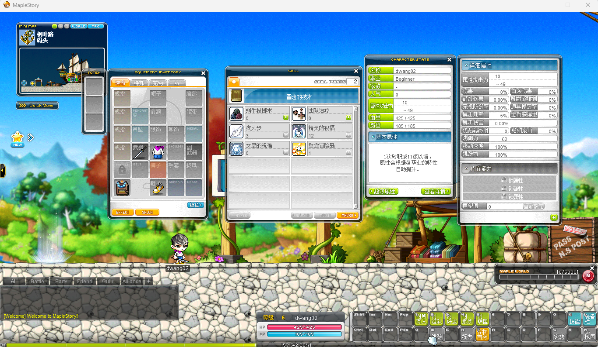

# swordie 232中文说明

# 补充
1. 添加中文脚本显示
2. 添加登陆器。（已实现远程登陆！！！）
3. 修复任务不能取消的问题
4. 更新服务端部署到服务器需要的更新
5. 新增tms245分支，想更新到tms245发现代码逻辑不够熟悉导致效率低下，暂时先不放出。

# 更新记录
## 2026-02-14
1. 汉化脚本，参考国产js脚本，不一定完全匹配
2. 汉化WZ，**感觉OrzRepacker作者**，单机游玩已完全足够。汉化使用CMS186比较接近
汉化如下：
- 技能栏
- 属性栏
- 键盘按钮
- 装备栏
- 设置按钮等

UIWINDOW4
StatusBar3

3. 新增部分教程脚本
4. 更新swordie 召唤NPC不能走路的问题

# 说明
1. 感谢国外的大佬开源了登陆器和hook的源码，当前已经成功在服务器上部署了，建议只是和朋友一起游玩。非常感谢提供的登陆器和hook！

2. 感觉客户端有一些问题，每次把鼠标放到技能栏上就会莫名卡顿。可能有技能检查之类的，暂时未解决
> 补充：汉化之后不卡了不知道原因

