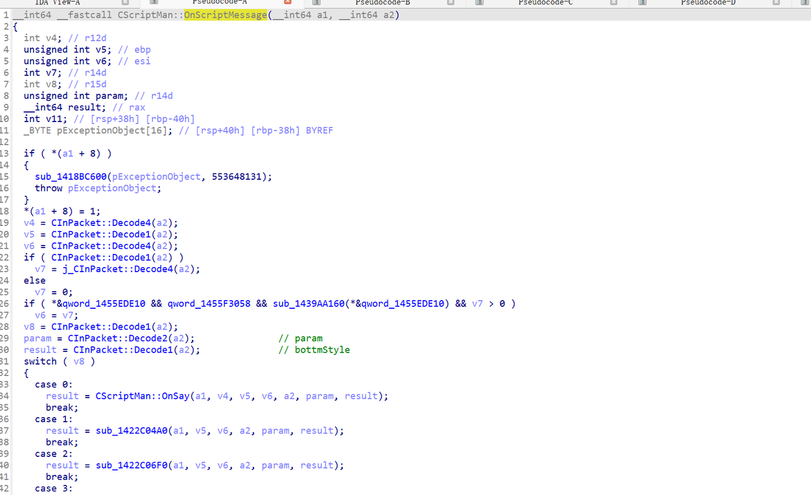
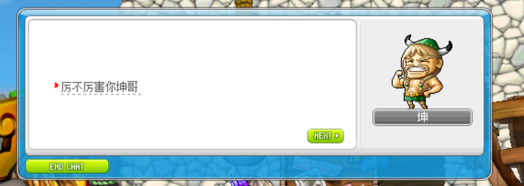

# 说明
最近在做GMS232的剧情修复，Swordie232虽然代码风格比较好，但是还是缺失了很多剧情的脚本，之前也尝试用python一个一个进行添加和修复，但是发现实现起来还是太慢了，需要每个文件都点开看，然后汉化和更新逻辑。突然诞生了一个想法就是把JS的脚本引擎集成到swordie中，这样后续对集成JS脚本也非常方便灵活。在集成过程中脚本的接口也有了一定的了解，浅浅的分享个人对于脚本控制的心得记录。

## 1. 什么是ScriptEngine
   在 Java 里，ScriptEngine = 让 Java 执行“非 Java 语言”的统一入口。它来自一个标准规范：JSR 223。ScriptEngine 有三个核心概念。 

### 概念 1：ScriptEngine 脚本执行器
   这是脚本执行器本身。
```java
ScriptEngine engine = new ScriptEngineManager()
        .getEngineByName("nashorn");
```

---
### 概念 2：Bindings 可以叫interaction
Bindings = 脚本里能“看见”的 Java 世界

```java
Bindings bindings = engine.createBindings();
bindings.put("cm", new CharacterManager());
bindings.put("map", map);
engine.eval(script, bindings);
```

在脚本里可以直接调用Java对象CharacterManager和MapleMap的接口
```java
cm.sendOk("hello");
map.spawnMonster(...)
```
- 有明确 API
- 不把实现暴露给脚本

---
### 概念 3：ScriptContext（作用域）
ScriptContext 有两个常用作用域：
- ENGINE_SCOPE   // 当前脚本
- GLOBAL_SCOPE   // 引擎全局

> 在项目中JS也不会去涉及作用域。因为当前js每个脚本都缓存一个ENGINE。每次执行都需要从缓存中拿出对应的引擎，然后去执行对应的方法。内部维护一个status进行流程的控制。把“脚本消息包”返回的参数传入进行脚本执行
python脚本使用JPython配合自己实现的阻塞和唤醒，脚本只需要执行一次就可以走完全部流程。相对来说干净了不少。
一个简单脚本比较：不是说python一定好，不然为什么要集成js XD。

js脚本：
```javascript
var status = -1;
var selectionLog = [];

function start() {
   action(1, 0, 0)
}

function action(d, c, b) {
   if (status == 0 && d == 0) {
      cm.dispose();
      return
   }(d == 1) ? status++ : status--;
   selectionLog[status] = b;
   var a = -1;
   if (status <= a++) {
      cm.dispose()
   } else {
      if (status === a++) {
         cm.sendNormalTalk("哎呀，被发现了！哇……你好像很会找嘛。真厉害！\r\n\r\n#fUI/UIWindow2.img/QuestIcon/8/0#\r\n3exp", 0, 2159015, false, true)
      } else {
         if (status === a++) {
            cm.gainExp(3);
            cm.updateInfoQuest(23007, "exp3=1");
            cm.dispose()
         }
      }
   }
};
```
python脚本
```python
# Cutie - Dangerous Hide-and-Seek : Neglected Rocky Mountain (931000001)
if "exp3=1" not in sm.getQRValue(23007):
    sm.sendNext("哎呀，被发现了！哇……你好像很会找嘛。真厉害！\r\n\r\n#fUI/UIWindow2.img/QuestIcon/8/0#\r\n3exp")
    sm.giveExp(3)
    sm.addQRValue(23007, "exp3=1")
else:
    sm.sendNext("Hehehe... I should have hidden somewhere else.")
```

另外：以下文档对js理解有一定帮助：
[北斗基础脚本教程](https://github.com/BeiDouMS/BeiDou-Server/wiki/%E5%8C%97%E6%96%97%E5%9F%BA%E7%A1%80%E8%84%9A%E6%9C%AC%E6%95%99%E7%A8%8B)


## 2. 集成JS脚本引擎
   前期工作做了很多种尝试的方案，在集成过程中也优化了原本python脚本解析的一些问题，最后使用如下方案进行集成：
1. 全部使用sowrdie的ScriptManager进行控制、以及相关的bean对数据进行传递。
2. 把核心步骤比如：加载脚本路径、参数绑定、脚本执行等方法抽象出来，分别jpython和nashron实现。

优点：
1. 集成的东西很少，只需要集成脚本的方法名和中间逻辑，发包和收包的处理完全不需要动，入侵性最小

缺点：
1. 需要对两个脚本引擎解析都基本了解（中等）
2. 需要十分明确swordie架构和CMS的架构的脚本处理以及相关结构体如何关联（困难）
3. 需要知道两者发包的区别，主要是参数对应（简单）

因为基本上脚本入侵性都非常强，和结构代码绑定都根深蒂固，很难完全解耦。看以前结构的设计现在看来会不合理，以前能正常使用,现在功能多了看起来很乱。 swordie和cms端架构基本就是两个东西，这样集成当然也是对MapleStory的服务端会有一个更加深入的理解，特别是脚本相关的内容。这对修复剧情和对话有很大帮助。之前还有好几个想法，实现到最后发现都无法集成，还是使用swordie架构进行处理脚本工作熟悉一些。
当前也没有全部集成完，没有使用AI进行集成，想把核心代码都搞懂，后续对逆向和升级版本都有帮助。一味的使用AI没什么意思。只集成了NPC的部分按照CMS的说法是集成了ScriptMessageAPI,按照swordie的说法是集成完了SendAndAsk相关的集成。还有很多其他类型脚本需要集成例如地图、事件、任务、反应堆、传送口等。具体可以去仓库代码查看。当前以我集成的NPC对话脚本为例进行说明：


## 3. 脚本消息包
   标准的包头名字是：LP_ScriptMessage。就是服务端发送脚本消息给客户端的包。发送的时机我自己简单整理了一下：
1. 触发了任务，需要进行NPC对话 USER_QUEST_REQUEST
2. 用户主动点了NPC客户端发送了USER_SELECT_NPC
3. 和NPC持续交互客户端发送了 USER_SCRIPT_MESSAGE_ANSWER

当客户端发送以上包过来时，可能会触发NPC的脚本对话。服务端需要发LP_ScriptMessage，当然还有其他包也要发，主要是这三个。

LP_ScriptMessage这里面就包含了所有可以发送脚本的信息，需要注意的就三个部分：

### 消息类型
在gms232中脚本的消息类型有73种，主要区别就是显示NPC对话的UI不同。进到对应的case里面看他如何接收，以及如何处理GMS232的地址可查看 00000001422BFB20。


在代码中位置是：
net.swordie.ms.life.npc.NpcMessageType
这里有很多主要几种类型
1. 普通对话
2. 其他风格
   普通对话和人物立绘对话还可以拆分成子类型：聊天(say)、输入(text)、选择是否（YesNo）、列表选择（#L）其他风格对话就很多了：万神殿传送门列表、美容美发、鬼魂公园_入场符咒组合等等。在swordie中主要还是普通对话为主

> 备注：不知道普通对话和带立绘的对话有啥不同，好像看起来都一样


其他风格对话，例如万神殿这个次元门就算其他风格对话

美容美发


### 消息参数param
在代码位置：
net.swordie.ms.life.npc.NpcScriptInfo.Param
上图也能看出来是param是一个2字节的类型。具体以下几种可以参考：
- 默认样式
- 不可退出
- 右侧显示自己
- 右侧显示NPC
- NPC脸反向
- 自己脸朝右
- 第二对话风格
- 特殊文字不跟随UI
- 加高底部对话框

主要影响的是人物是在左边还是右边，是否是人说话还是NPC说话、UI的改变等等。通过每次发包的参数控制来控制当前是谁在说话：

第二对话风格为


### 其他参数
存放脚本需要使用的其他参数，比如输入数字范围，自定义的长度等等，作为NPC脚本信息传递数据
net.swordie.ms.life.npc.NpcScriptInfo

## 4. swordie脚本优化
   为了更好集成双脚本系统主要做了以下更新：
1. 修改了ScriptMangerImpl的start逻辑顺序，修改后的顺序为：
```javascript
   // step1: 设置路径和引擎
   // step2: 获取脚本内容
   // step3: 绑定脚本参数
   // step4: 执行
   // step 5 停止
```
   同时这几步也是js和python需要单独处理的部分

2. 按照脚本的功能拆分出不同的API文件
   原本所有脚本全部放在一个文件中，导致一个文件3000+行看起来非常乱，现在分到不同文件增加可读性和更好的进行拓展。本身就有注释类型只不过拆出来而已：
```javascript
   PyBossAPI
   PyCharacterStatAPI
   PyCharacterTemporaryStatAPI
   PyChatAPI
   PyClockAPI
   PyFieldreAPI
   PyGuildAllianceAPI
   PyInGameDirectionEventAPI
   PyInventoryAPI
   PyMobAPI
   PyNPCAPI
   PyOtherAPI
   PyPartyAPI
   PyPartyQuestAPI
   PyQuestAPI
   PyReactorAPI
   PySendAskAPI
   PyUnionAPI

```

## 5. 最后
1. js脚本引擎使用的Binding类怎么来说一下我的思路：
   使用python脚本进行如下操作： 
- 从ts文件分离出不同的脚本API，并生成空方法体的java文件。 
- 重新排序一下方法，比较好看出关联性
- 按照python的Binding类 写法填充方法体。默认的Binding类是ScriptManagerImpl，我拆出来了比较好进行比较和更新。

2. 以上都是个人当前见解，一定有理解不到位的地方，欢迎大家讨论，能够相互学习谢谢。