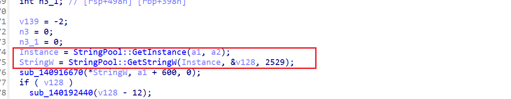
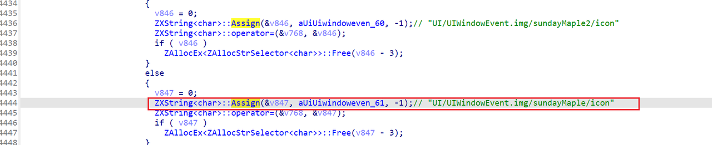
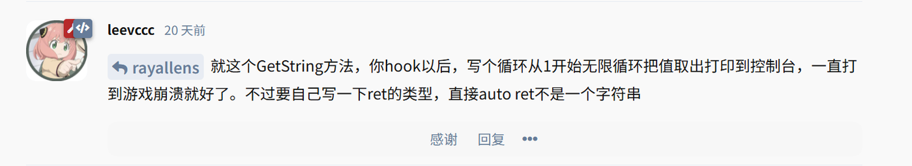
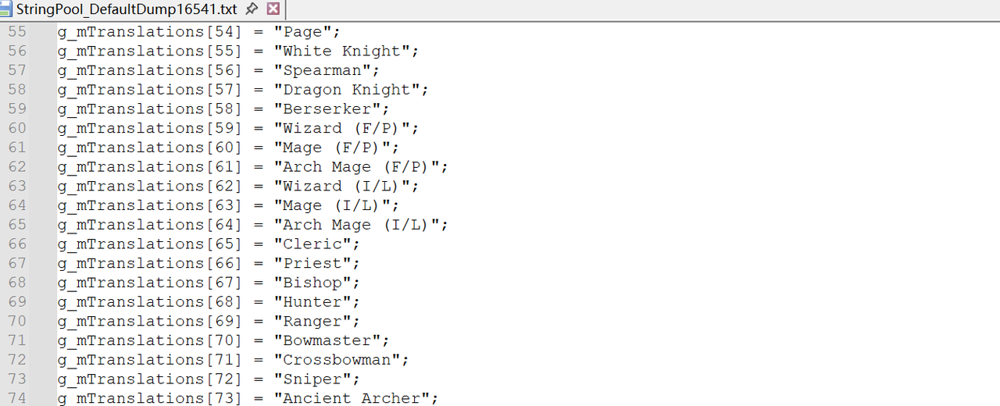

# 说明
之前对客户端的技术完全不懂，小弟正在学习客户端逆向研究等技术，觉得会改客户端的都很牛皮，琢磨从汉化开始感觉会比较简单一点，想尝试自己汉化一个StringPool的版本，分享一点心得体会。

## 0. 打开客户端IDA文件
我也不会拿大佬做好的.

## 1. 找到原版StringPool两个地址
- StringPool__GetString_t ：读取String
- ZXString_char__Assign_t   分配内存写入char

### StringPool__GetString_t
- Strings搜：UI/UIWindow4.img/coordiKing/avatarUI/bgPreVote
- 进入方法：```CUICoordinationContestAvatar::OnCreate```
前面两个就是：


```javascript
Instance = StringPool::GetInstance(); 
StringW = StringPool::GetStringW(Instance, &v156, 2529);
```

2529表示的就是StringPool的下标2529的值读出来。进到最里面就是

### ZXString_char__Assign_t
字符串找：UI/UIWindowEvent.img/sundayMaple/icon 然后找到引用就是：

说明：以上两个方法是我自己经过实战，找出来最简单找到的方法，当然使用特征值去找也行，但是64位我用特征值没找到。低版本这样找不到


## 2. 打印原版客户端的值
按照站长的说法进行尝试：

   
原理：hook到GetString，然后就去循环打stringpool里面的值。
```java
BOOL __fastcall hookStrings2()
{
   if (g_pStringPoolInstance == nullptr)
   {
      printf("[hookStrings2] StringPool instance not ready.\n");
      return FALSE;
   }

        const __int64 kMinIndex = 0;
        const __int64 kMaxIndex = 30000;
        const __int64 kBreakAfterIndex = 17000;
        const int kMaxEmptyStreak = 4000;

   std::ofstream out("StringPool_DefaultDump.txt", std::ios::out | std::ios::trunc);
   if (!out.is_open())
   {
      printf("[hookStrings2] Failed to open output file.\n");
      return FALSE;
   }

   int emptyStreak = 0;
   int writtenCount = 0;
   for (__int64 idx = kMinIndex; idx <= kMaxIndex; ++idx)
   {
      ZXString<char> result;
      result.m_pStr = nullptr;
      StringPool__GetString1(g_pStringPoolInstance, &result, idx);

      if (result.m_pStr == nullptr || result.m_pStr[0] == '\0')
      {
         ++emptyStreak;
         if (idx >= kBreakAfterIndex && emptyStreak >= kMaxEmptyStreak)
         {
            break;
         }
         continue;
      }

      emptyStreak = 0;
                const std::string escaped = escapeForCppString(result.m_pStr);

      // For easy copy/paste to hookStrings_2
      out << "g_mTranslations[" << idx << "] = \"" << escaped << "\";" << '\n';
      // For index lookup during translation work
      //out << "index:" << idx << " " << result.m_pStr << '\n' << '\n';
      ++writtenCount;
   }

   out.close();
   printf("[hookStrings2] Dump complete. wrote=%d file=StringPool_DefaultDump.txt\n", writtenCount);
   return TRUE;
}

```

客户端dump出来的结果如下：

## 3. 翻译成中文
> 省略，直接丢给AI帮你翻译

## 4. Hook客户端的StringPool
重新hook你的客户端
```java
BOOL __fastcall hookStrings() {

        g_mTranslations[54] = "准骑士";
        g_mTranslations[55] = "骑士";
        g_mTranslations[56] = "枪兵";
        g_mTranslations[57] = "龙骑士";
        g_mTranslations[58] = "黑骑士";
        g_mTranslations[59] = "火毒巫师";
        g_mTranslations[60] = "火毒法师";
        g_mTranslations[61] = "魔导师 (火，毒)";
        g_mTranslations[62] = "冰雷巫师";
        g_mTranslations[63] = "冰雷法师";
        。。
    
        
        BOOL result = TRUE;
        result &= SetHook(TRUE, reinterpret_cast<void**>(&StringPool__GetString1), getStringHook1);
        return result;

}

ZXString<char>* __fastcall getStringHook1(ZXString<char>* result, __int64 nIdx)
{
        std::shared_lock<std::shared_mutex> lock(translate_mutex);
        if (translate.count(nIdx) > 0)
        {
                auto szEntry = translate[nIdx];
                result->m_pStr = nullptr;
                ZXString_char__Assign(result, szEntry.c_str(), -1);
                return result;
        }
        return StringPool__GetString1(result, nIdx);
}
```
### 代码说明：
#### 先查你自己的翻译表
```java
std::shared_lock<std::shared_mutex> lock(translate_mutex);
if (translate.count(nIdx) > 0)
```
作用：
-  加读锁（线程安全）
-  判断这个 nIdx 有没有你自定义的翻译

---
#### 如果有 → 直接替换字符串
```java
auto szEntry = translate[nIdx];
result->m_pStr = nullptr;
ZXString_char__Assign(result, szEntry.c_str(), -1);
return result;

```
关键点：
```result->m_pStr = nullptr;```
-  清掉原来的字符串（避免内存问题 or 强制重新赋值）

```   ZXString_char__Assign(...)```
- 等价于：
   给 ZXString 赋值字符串

参数说明：
- result → this
- szEntry.c_str() → 你的翻译字符串
- -1 → 自动计算长度（常见写法）
  结果：原本游戏返回的字符串，替换成：
  translate[nIdx]

---
#### 如果没有 → 调回原函数
return StringPool__GetString1(result, nIdx);

## 后记
1. I虽然加速了我们的开发和分析的速度，但是个人对于技术的理解感觉越来越浅，还是要多进行实战加深理解XD。 
2. 感谢Koson提供的GMS232的StringPool以供研究
3. 客户端相关逆向以及翻译都不是特别熟悉和擅长，如有别的方法欢迎讨论~

参考：https://moguwuyu.com/d/13